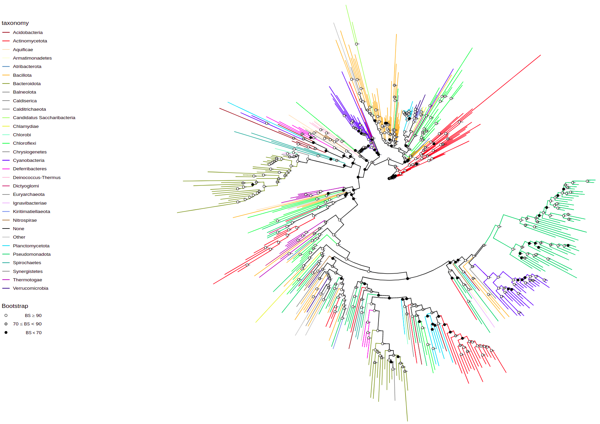
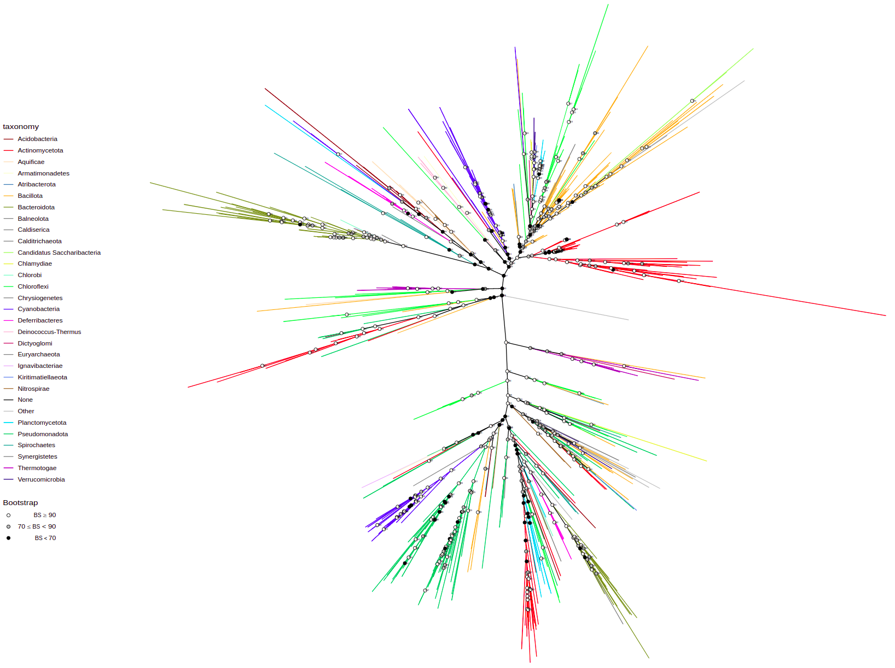
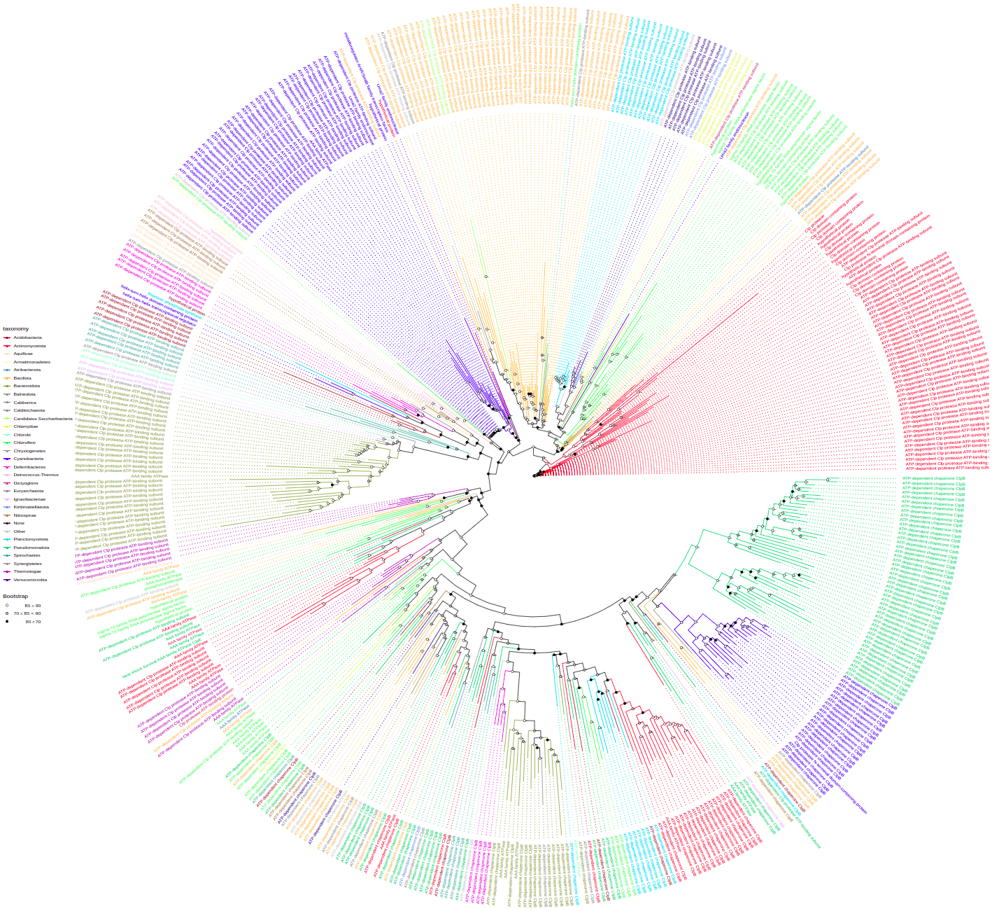
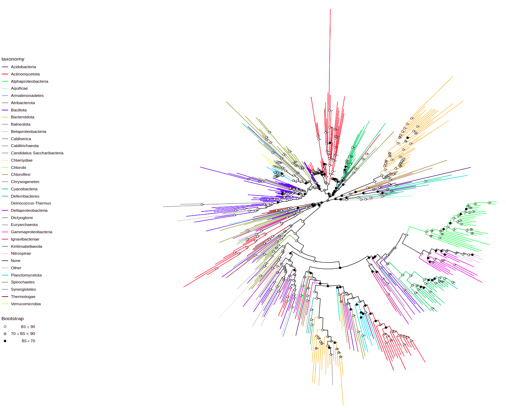
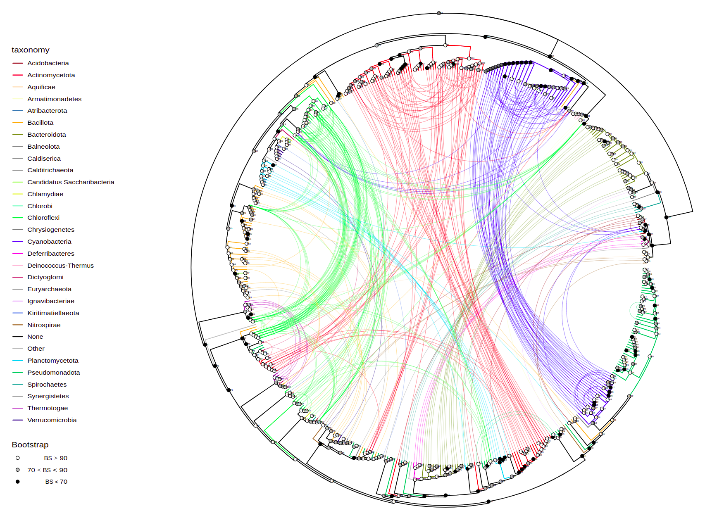

WORK IN PROGRESS

# tree-annotation
R scripts to annotate protein phylogenetic trees with data, annotate species trees with protein phyletic patterns and plot

# Usage
Currently, this tool is designed for working with data produced by **pegp** tool (https://github.com/stovc/pegp). Perhaps in the future it will become more flexible.

## Preparation

1) Load functions from tree_annotation.R and plot_tree.R
```R
source('[path to tree_annotation.R]')
source('[path to plot_tree.R]')
```
2) Set working directory to directory with your data:
```R
setwd('[path to your data]')
```

3) Load data

```R
# protein tree
tree <- read.iqtree(file="tree.contree")

# annotation dataframe
annotation <- read.csv("filtered_clustered.csv")

# load the annotation data of filtered but not clustered hits (for the bacterial tree with phyletic pattern)
filtered_data <- read.csv("filtered_hits.csv")[, c('ID', 'assembly', 'taxid')]

# load the cluster data. which protein inherits properties from which representative
cluster_data <- read.csv("cluster_dict.csv")

# load the domain data.list of domains: which molecule they belong, domain name, start & end coordinates
domain_data <- read.csv("domains.csv")

# load genome context data
context_data <- read_context_data()  # working directory should contain "genome_context.csv" file

# LOAD SPECIES TREES AND ANNOTATIONS
org_tree_full <- read.tree(file="org_trees/org_tree_full.nwk")
org_tree_genus <- read.tree(file="org_trees/org_tree_genus.nwk")
org_tree_family <- read.tree(file="org_trees/org_tree_family.nwk")
org_tree_order <- read.tree(file="org_trees/org_tree_order.nwk")
org_tree_class <- read.tree(file="org_trees/org_tree_class.nwk")
org_tree_phylum <- read.tree(file="org_trees/org_tree_phylum.nwk")

org_tree_data <- read_delim("org_trees/org_tree_full_data.csv", delim=';')
```

## Tree exploration

For the most basic tree run
```R
plot_tree(tree, filename="tree-base.svg", width=50, height=50)
```


By default it has circular layout, colored by taxonomy (phyla), and shows bootstrap values. These parameters are tweakable and additional annotations can be added.

You can change tree layout using `layout` parameter. Available options: "circular", "rectangular", "equal_angle", "inward_circular".
```R
plot_tree(tree, layout="equal_angle", filename="equal_angle.svg", width=50, height=50)
```


You can label tree tips by `tips` parameter by different data associated with the tree, e.g. "gene", "product", "species", and so on.
```R
plot_tree(tree, tips="product", filename="tree-base-product.svg", width=75, height=75)
```


To annotate some taxa on a lower taxonomic level use `tax_expand` parameter that contains taxon or vector of taxa that should be annotated at higher pescision. Here, we annotate Pseudomonadota (these are Proteobacteria) at the level of class
```R
plot_tree(tree, tax_expand="Pseudomonadota", 
          filename="tree-expanded.svg", width=50, height=50)
```


Depending on your observations you might want to reroot the tree using `root()` function provided by ggtree
```R
tree = root(tree, node=697)
```

Taxalink
```R
plot_tree(tree, layout="inward_circular", taxalink=T, branch_length='none',
          width=50, height=33, filename="tree-taxalink.svg")
```

