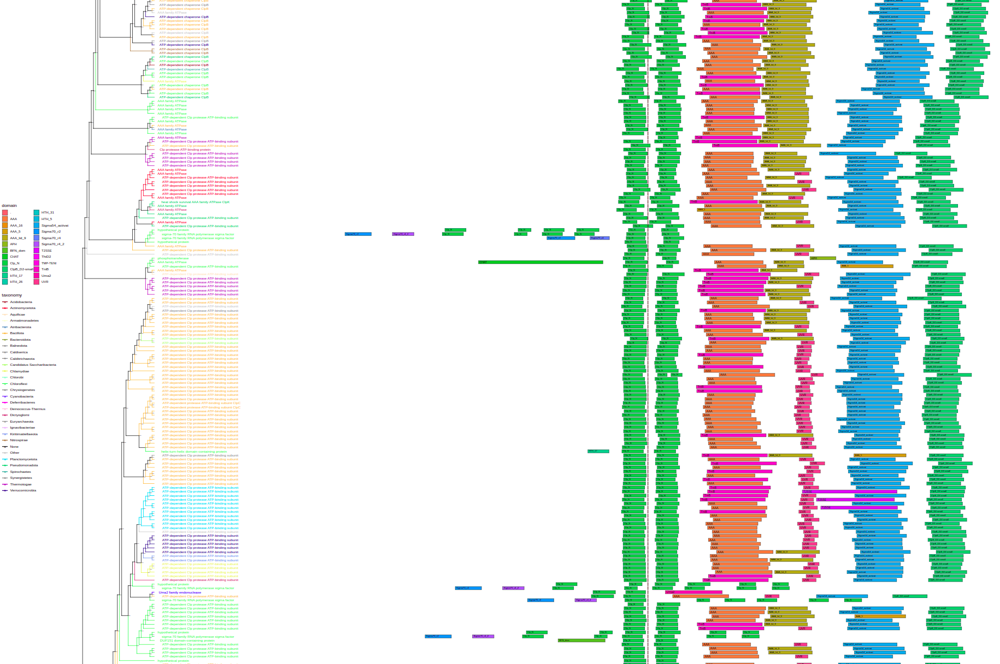
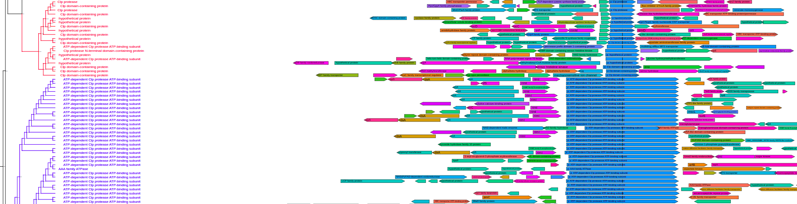
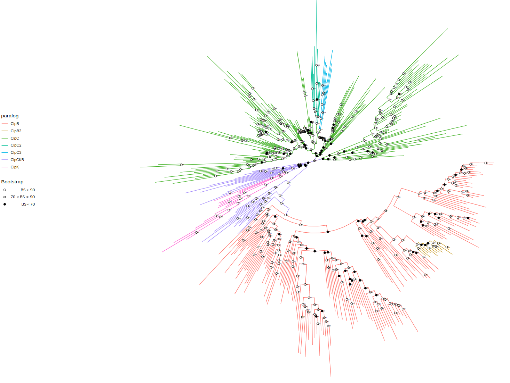
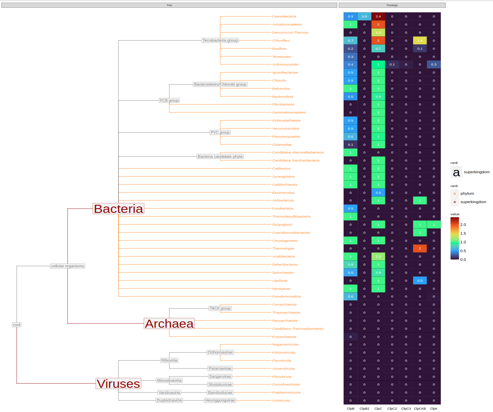
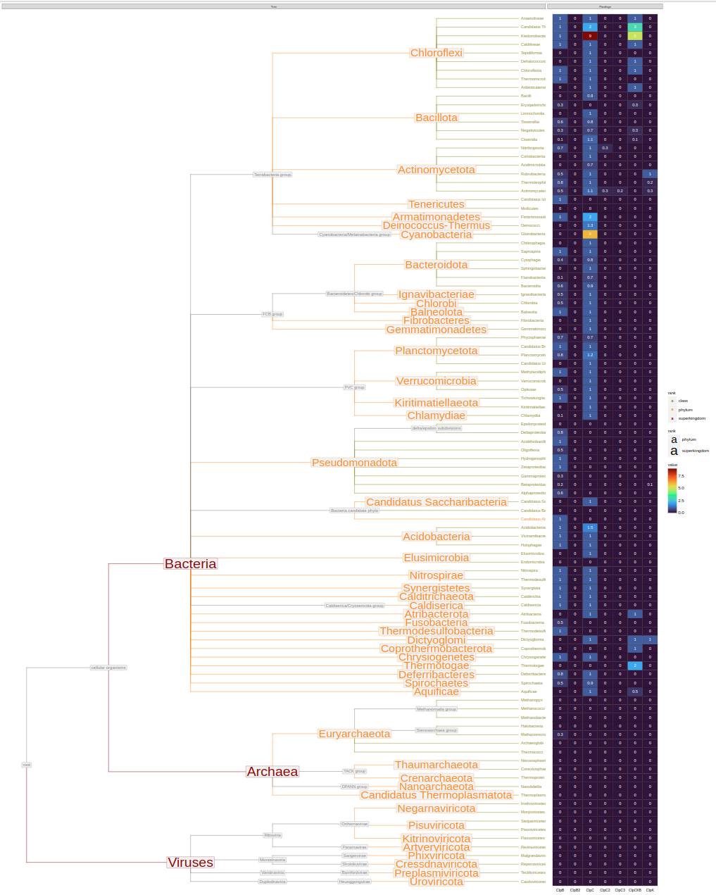

WORK IN PROGRESS

# tree-annotation
R scripts to annotate protein phylogenetic trees with data, annotate species trees with protein phyletic patterns and plot

# 1. Requirements
1) Make sure to install
```R
library(tidyr)
library(dplyr)
library(readr)
library(data.table)
library(ggplot2)
library(treeio)
library(ggtree)
library(gggenes)
library(ape)
library(ggtreeExtra)
library(ggnewscale)
```

To install **ggtree** run in the R console
```R
if (!require("BiocManager", quietly = TRUE))
    install.packages("BiocManager")

BiocManager::install("ggtree")
```

To install **ggtreeExtra** run
```R
if (!require("BiocManager", quietly = TRUE))
    install.packages("BiocManager")

BiocManager::install("ggtreeExtra")
```

For the rest try
```R
install.packages(package)
```

# 2. Usage
Currently, this tool is designed for working with data produced by **pegp** tool (https://github.com/stovc/pegp). Perhaps in the future it will become more flexible.

## Preparation

1) Load functions from tree_annotation.R and plot_tree.R
```R
source('[path to tree_annotation.R]')
source('[path to plot_tree.R]')
```
2) Set working directory to directory with your data:
```R
setwd('[path to your data]')
```

3) Load data

```R
# protein tree
tree <- read.iqtree(file="tree.contree")

# annotation dataframe
annotation <- read.csv("filtered_clustered.csv")

# load the annotation data of filtered but not clustered hits (for the bacterial tree with phyletic pattern)
filtered_data <- read.csv("filtered_hits.csv")[, c('ID', 'assembly', 'taxid')]

# load the cluster data. which protein inherits properties from which representative
cluster_data <- read.csv("cluster_dict.csv")

# load the domain data.list of domains: which molecule they belong, domain name, start & end coordinates
domain_data <- read.csv("domains.csv")

# load genome context data
context_data <- read_context_data()  # working directory should contain "genome_context.csv" file

# LOAD SPECIES TREES AND ANNOTATIONS
org_tree_full <- read.tree(file="org_trees/org_tree_full.nwk")
org_tree_genus <- read.tree(file="org_trees/org_tree_genus.nwk")
org_tree_family <- read.tree(file="org_trees/org_tree_family.nwk")
org_tree_order <- read.tree(file="org_trees/org_tree_order.nwk")
org_tree_class <- read.tree(file="org_trees/org_tree_class.nwk")
org_tree_phylum <- read.tree(file="org_trees/org_tree_phylum.nwk")

org_tree_data <- read_delim("org_trees/org_tree_full_data.csv", delim=';')
```

## Tree exploration

For the most basic tree run
```R
plot_tree(tree, filename="tree-base.svg", width=50, height=50)
```


By default it has circular layout, colored by taxonomy (phyla), and shows bootstrap values. These parameters are tweakable and additional annotations can be added.

You can change tree layout using `layout` parameter. Available options: "circular", "rectangular", "equal_angle", "inward_circular".
```R
plot_tree(tree, layout="equal_angle", filename="equal_angle.svg", width=50, height=50)
```


You can label tree tips by `tips` parameter by different data associated with the tree, e.g. "gene", "product", "species", and so on.
```R
plot_tree(tree, tips="product", filename="tree-base-product.svg", width=75, height=75)
```


To annotate some taxa on a lower taxonomic level use `tax_expand` parameter that contains taxon or vector of taxa that should be annotated at higher pescision. Here, we annotate Pseudomonadota (these are Proteobacteria) at the level of class
```R
plot_tree(tree, tax_expand="Pseudomonadota", 
          filename="tree-expanded.svg", width=50, height=50)
```


Depending on your observations you might want to reroot the tree using `root()` function provided by ggtree
```R
tree = root(tree, node=697)
```

Taxalink
```R
plot_tree(tree, layout="inward_circular", taxalink=T, branch_length='none',
          width=50, height=33, filename="tree-taxalink.svg")
```


Domain architecture
```R
plot_tree(tree, domains=domain_data, tips="product", 
          layout="rectangular", branch_length="none", bootstrap=F,   # <-- params to make it not brake
          filename="tree-domains.svg", height=200)
```



Genome context
```R
plot_tree(tree, context=context_data, tips="product", 
          layout="rectangular", branch_length="none", bootstrap=F, legend='none',  # <-- params to make it not brake
          filename="tree-context.svg", height=200)
```


Assign paralogs
```R
paralog_df = data.frame(
  node    = c(798,    690,     698,     760,    798,    778,    1002,    1012,  824), 
  paralog = c("ClpB", "ClpC", "ClpC", "ClpCKB", "ClpB", "ClpK", "ClpC2", "ClpC3", "ClpB2")
)
tree <- assign_paralogs(tree, "ClpCKB", paralog_df)

plot_tree(tree, color="paralog",
          width=50, height=50, filename="tree-paralogs.svg")
```


Once paralogs are assigned, you can annotate organism trees
```R
species = annotate_org_tree(org_tree_full, org_data_full, tree)

phylum = copy_annotation(org_tree_family, org_tree_full_a)
class = copy_annotation(org_tree_class, org_tree_full_a)
order = copy_annotation(org_tree_class, org_tree_full_a)
family = copy_annotation(org_tree_class, org_tree_full_a)
genus = copy_annotation(org_tree_class, org_tree_full_a)
```

And plot them at different taxonomic ranks
```R
plot_org_tree(phylum, filename='org_tree_phylum.svg')
```


```R
plot_org_tree(class, filename='org_tree_class.svg')
```

