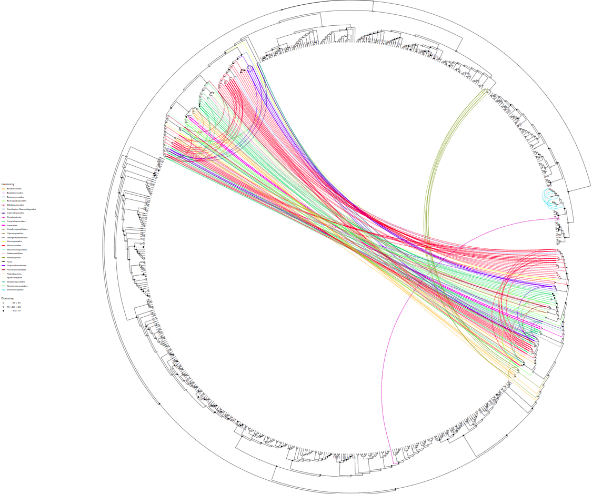
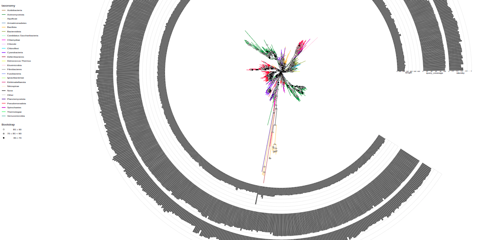
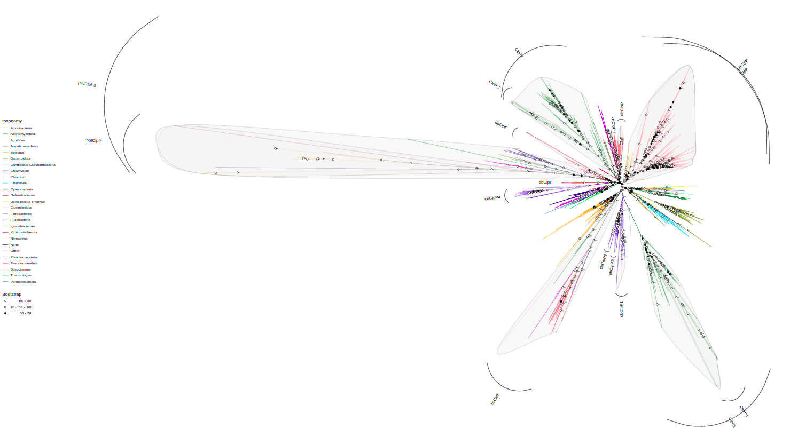
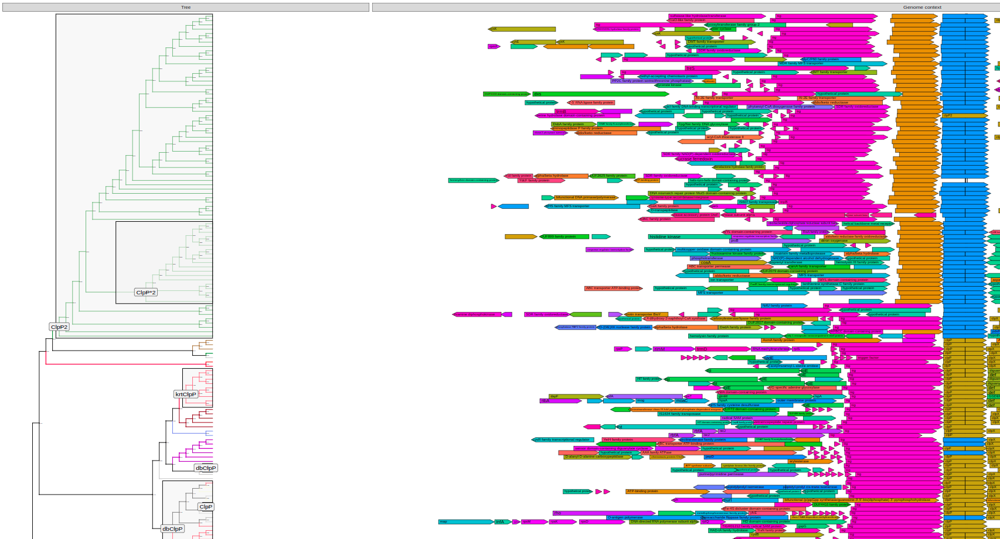

WORK IN PROGRESS

tree-annotation
===============

R scripts for annotation and exploration of protein phylogenetic trees and annotation of organism trees with phyletic patterns based on .

Features
--------

### Tree annotation

- Annotation of nodes by tip-associated information by traversing along to the last ancestor
- Manual annotation
- Annotation of organism tree with occurence phyletic pattern from gene tree with grouping and taxonomic information

### Tree visualization
- One code line plotting with annotations from columns
    - branch color
    - tip text
    - bar plots
    - internal and external labels
    - highlights
    - bootstrap information
- Flexible adjustment of taxonomic annotation
- Linking taxa by sharing same property in a column
- Visualization of domain architecture and genome context data
- Visualization of trees with phyletic patterns at specified taxonomic prescision

Requirements
------------

1) Make sure to install
```R
library(tidyr)
library(dplyr)
library(readr)
library(data.table)
library(ggplot2)
library(treeio)
library(ggtree)
library(gggenes)
library(ape)
library(ggtreeExtra)
library(ggnewscale)
```

To install **ggtree** run in the R console
```R
if (!require("BiocManager", quietly = TRUE))
    install.packages("BiocManager")

BiocManager::install("ggtree")
```

To install **ggtreeExtra** run
```R
if (!require("BiocManager", quietly = TRUE))
    install.packages("BiocManager")

BiocManager::install("ggtreeExtra")
```

For the rest try
```R
install.packages(package)
```

Usage
-----

Currently, this tool is designed for working with data produced by  tool. Perhaps in the future it will become more flexible.

### Preparation

1) Load functions from tree_annotation.R and plot_tree.R
```R
source('[path to tree_annotation.R]')
source('[path to plot_tree.R]')
```
2) Set working directory to directory with your data:
```R
setwd('[path to your data]')
```

3) Load data

```R
# protein tree
tree <- read.iqtree(file="tree.contree")

# annotation dataframe
annotation <- read.csv("filtered_clustered.csv")

# load the annotation data of filtered but not clustered hits (for the bacterial tree with phyletic pattern)
filtered_data <- read.csv("filtered_hits.csv")[, c('ID', 'assembly', 'taxid')]

# load the cluster data. which protein inherits properties from which representative
cluster_data <- read.csv("cluster_dict.csv")

# load the domain data.list of domains: which molecule they belong, domain name, start & end coordinates
domain_data <- read.csv("domains.csv")

# load genome context data
context_data <- read_context_data("genome_context.csv")  # working directory should contain "genome_context.csv" file

# LOAD SPECIES TREES AND ANNOTATIONS
org_tree_full <- read.tree(file="org_trees/org_tree_full.nwk")
org_tree_genus <- read.tree(file="org_trees/org_tree_genus.nwk")
org_tree_family <- read.tree(file="org_trees/org_tree_family.nwk")
org_tree_order <- read.tree(file="org_trees/org_tree_order.nwk")
org_tree_class <- read.tree(file="org_trees/org_tree_class.nwk")
org_tree_phylum <- read.tree(file="org_trees/org_tree_phylum.nwk")

org_tree_data <- read_delim("org_trees/org_tree_full_data.csv", delim=';')
```

3) Tweak your data if you need
For example, replace "Candidatus" to "C." in org_tree_data

```R
library('stringr')
org_tree_data$name <- str_replace(org_tree_data$name, "Candidatus", "C.")
```

4) Annotate the tree with data
```R
tree <- annotate_tree(tree, annotation)
```

### Tree exploration

#### Basics

For the most basic tree run
```R
plot_tree(tree, filename="tree-base.svg", width=50, height=50)
```


By default it has circular layout, colored by taxonomy (phyla), and shows bootstrap values. These parameters are tweakable and additional annotations can be added.

You can change tree layout using `layout` parameter. Available options: "circular", "rectangular", "equal_angle", "inward_circular".

```R
plot_tree(tree, layout="equal_angle", filename="equal_angle.svg", width=50, height=50)
```


You can label tree tips by `tips` parameter by different data associated with the tree, e.g. "gene", "product", "species", and so on.

```R
plot_tree(tree, tips="product", filename="tree-base-product.svg", width=75, height=75)
```


#### Adjustment of taxonomic annotation

To annotate some taxa on a lower taxonomic level use `tax_expand` parameter that contains taxon or vector of taxa that should be annotated at higher pescision. Here, we annotate Pseudomonadota (these are Proteobacteria) at the level of class
```R
plot_tree(tree, tax_expand="Pseudomonadota", 
          filename="tree-expanded.svg", width=50, height=50)
```


Also you can specify the taxon, you want to start the annotation from by `tax_start` parameter
```R
plot_tree(tree, layout="inward_circular", taxalink=T, branch_length='none', tips="gene",
          tax_start="Actinomycetota", tax_expand=c("Actinomycetota", "Actinomycetes"),
          width=100, height=100, filename="tree-taxalink-Act.svg")
```



#### Annotations

##### Barplots

You can plot quantitative information from columns by `bars` parameter

```R
plot_tree(tree, filename="tree-bars.svg", bars=c("length", "query_coverage", "identity"), width=75, height=75)
```



##### Highlight and outer labels
Use `highlight` parameter to highlight branches by values in a column
Use `label_out` parameter to make outer labels branches by values in a column 

```R
plot_tree(tree, highlight="paralog_anc", label_out="paralog_anc", bootstrap=F, 
          width=150, height=150, filename="tree-paralogs-HL.svg")
```



##### Inner labels
Use `label` to label nodes by value in a column

```R
plot_tree(tree, label="paralog_anc", highlight="paralog_anc",context=context_data,
          layout="rectangular", branch_length="none", bootstrap=F, legend='none', # <-- params to make it not brake
          filename="tree-context-para.svg", height=200)
```



#### Rerooting

Depending on your observations you might want to reroot the tree using `root()` function provided by ggtree
```R
tree = root(tree, node=697)
```

#### Taxalink

Link tips that have the same "assembly" value (what genome they are encoded in). To be custom in the future

```R
plot_tree(tree, layout="inward_circular", taxalink=T, branch_length='none',
          width=50, height=33, filename="tree-taxalink.svg")
```


#### Domain architecture

```R
plot_tree(tree, domains=domain_data, tips="product", 
          layout="rectangular", branch_length="none", bootstrap=F,   # <-- params to make it not brake
          filename="tree-domains.svg", height=200)
```


#### Genome context

```R
plot_tree(tree, context=context_data, tips="product", 
          layout="rectangular", branch_length="none", bootstrap=F, legend='none',  # <-- params to make it not brake
          filename="tree-context.svg", height=200)
```


#### Assign paralogs

```R
paralog_df = data.frame(
  node    = c(798,    690,     698,     760,    798,    778,    1002,    1012,  824), 
  paralog = c("ClpB", "ClpC", "ClpC", "ClpCKB", "ClpB", "ClpK", "ClpC2", "ClpC3", "ClpB2")
)
tree <- assign_paralogs(tree, "ClpCKB", paralog_df)

plot_tree(tree, color="paralog",
          width=50, height=50, filename="tree-paralogs.svg")
          
```


#### Organism tree annotation

Once paralogs are assigned, you can annotate organism trees

```R
species = annotate_org_tree(org_tree_full, org_data_full, tree)

phylum = copy_annotation(org_tree_family, org_tree_full_a)
class = copy_annotation(org_tree_class, org_tree_full_a)
order = copy_annotation(org_tree_class, org_tree_full_a)
family = copy_annotation(org_tree_class, org_tree_full_a)
genus = copy_annotation(org_tree_class, org_tree_full_a)
```

#### Organism tree plotting

And plot them at different taxonomic ranks

```R
plot_org_tree(phylum, filename='org_tree_phylum.svg')
```


```R
plot_org_tree(class, filename='org_tree_class.svg')
```


